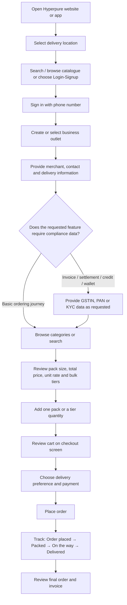

# Zomato Hyperpure UI/UX & Workflow Audit

**Prepared by:** Sampritha Sureshkumar  
**Prepared for:** Internship selection assignment  
**Audit date:** 12 July 2026  
**Product:** Zomato Hyperpure — B2B procurement platform for food businesses  
**Platforms reviewed:** Public website, official Android/iOS store pages, official product pages, official Terms, and official Hyperpure content  
**Research constraint:** No private merchant account, document upload, or live purchase was used

---

## 1. Executive Summary

Hyperpure adapts ecommerce patterns to restaurant procurement by making **pack configuration, total pack price, normalized unit price, and bulk-discount thresholds** visible near the buying action. Its catalogue is structured around restaurant operations rather than household shopping: ingredients, meat and seafood, packaging, cleaning supplies, kitchenware, appliances, and ready-to-cook products are available within the same procurement environment.[1][2]

The most effective observed pattern is the **volume-pricing interaction**. A product can show a normal unit rate, a lower “Best rate,” and buttons such as **Add 3**, **Add 5**, or **Add 6** for the quantities that unlock a tier. This reduces the calculation burden on a business buyer because the interface translates a threshold such as “15 kg+” into the required number of sellable packs.[3][4]

The strongest workflow improvements visible in recent official release notes are:

- a redesigned search and product-detail experience,
- a cart that allows review and order finalization on one screen,
- recorded voice instructions for the delivery agent,
- and management of multiple outlets under one account.[5]

A key research finding is that the assignment’s assumption about mandatory GSTIN and FSSAI onboarding should not be repeated as fact. Hyperpure’s official December 2025 article says a phone number is sufficient to sign in and start ordering. Its Terms require merchant and delivery information and require GSTIN, PAN, and other documents for invoices and payment settlement. The reviewed Terms do not identify FSSAI as a universal signup requirement.[6][7] The safest conclusion is that the public evidence **suggests progressive compliance**, but the exact document-gating and pending/verified screens require testing with an authorized merchant account.

### Overall evaluation

| Area | Evaluation | Confidence |
|---|---|---|
| Catalogue structure | Strong restaurant-focused hierarchy | High |
| Product-card economics | Very strong pack and unit-price clarity | High |
| Volume pricing | Strong, actionable tier controls | High |
| Search | Useful product/category search; partial matching visible; advanced typo handling not proven | Medium |
| Onboarding verification | Phone-first entry is confirmed; document-state UI is not publicly observable | Medium |
| Cart and tax breakdown | One-screen checkout is confirmed by release notes; current detailed tax/MOV UI is not observable | Medium–low |
| Delivery | Preferred-slot messaging, next-day delivery, and voice delivery instructions are visible in official sources | Medium–high |
| Tracking | Four-step order timeline is visible in an official screenshot | Medium–high |
| Invoice download | Formal invoices are confirmed; exact PDF-download path is not publicly confirmed | Low |

---

## 2. Research Method and Evidence Rules

### 2.1 Evidence labels

- **Observed — current official source:** directly visible on Hyperpure’s website, Terms, or current store listing.
- **Observed — official promotional screenshot:** visible in an official app-store image; the underlying screen may not be the latest production layout.
- **Official release-note evidence:** a feature announced in the App Store version history.
- **Inferred:** a reasonable interpretation, clearly identified as such.
- **Not publicly testable:** requires an authenticated merchant account, serviceable location, document submission, or completed transaction.
- **Recommendation:** a proposed design, not a claim about Hyperpure.

### 2.2 Limitations

1. Product availability, price, bulk tiers, taxes, minimum order, and delivery promises can vary by location and date.
2. The public website exposes rich catalogue information but not the full authenticated checkout.
3. No GSTIN, PAN, FSSAI licence, or KYC document was submitted.
4. No order was placed, so final tax reconciliation, substitutions, invoice download, and return handling were not tested.
5. Three official Google Play promotional screenshots are included as visual evidence. They are labelled with source and scope notes and should not be treated as proof of every current authenticated screen.

---

## 3. End-to-End Workflow

### 3.1 Evidence-based journey



**Evidence note:** Location, phone sign-in, catalogue structure, pack economics, one-screen checkout announcement, preferred-slot delivery, payment options, and four-step tracking are supported by official sources.[1][5][6][8][9] The exact document sequence, approval states, current minimum-order warning, tax card, and invoice-download control remain unverified.

### 3.2 Plain-text fallback

```text
Location
  → phone sign-in
  → business/outlet details
  → optional feature-specific compliance
  → category/search
  → product and bulk-tier selection
  → cart/checkout
  → delivery preference and payment
  → order tracking
  → invoice and post-purchase records
```

---

# 4. Onboarding and Business Verification

## 4.1 Account setup

### Observed findings

The public header prioritizes:

1. delivery location,
2. catalogue browsing,
3. search,
4. login/signup.[1]

This is appropriate for B2B procurement because location determines whether a product is serviceable and can affect assortment, rates, and delivery.

Hyperpure states that a user needs a **phone number to sign in and start ordering**.[6] The Terms separately require the merchant to maintain accurate information including business name, address, telephone number, email, manager/contact-person details, delivery address, and delivery times.[7]

The iOS version history states that merchants can add and manage **multiple outlets under one account**.[5] This is an important B2B feature because a restaurant chain may have different delivery addresses, receiving hours, catalogues, and budgets.

### Likely account model

```text
Phone number and OTP
  → active delivery location
  → business/outlet profile
  → contact person
  → delivery address and receiving time
  → catalogue and ordering
  → extra documents when a financial/compliance feature needs them
```

The exact OTP screen, map-pin control, shop coordinates, owner designation, and business-type options were not publicly verified.

## 4.2 GSTIN, PAN, FSSAI and KYC

### Confirmed

Hyperpure’s Terms state that merchants provide GSTIN, PAN, and other requested documents for appropriate invoices and payment settlement. The same Terms state that the invoice is raised at delivery with prescribed GST particulars.[7]

For credit evaluation, PAN and GST information may be used to assess eligibility and credit limit. For Hyperpure Wallet, KYC information can be requested, and wallet access can be restricted when documentation is insufficient.[7]

### Not confirmed

- FSSAI as a universal requirement during first signup
- exact GSTIN/PAN upload screens
- automatic document OCR or government-database validation
- approval time
- “pending,” “verified,” and “rejected” labels
- whether basic ordering is blocked while a document is under review

### Audit conclusion

Public evidence indicates a low-friction phone entry combined with later business/compliance requirements. This **suggests**, but does not conclusively prove, progressive onboarding.

| Capability | Confirmed public requirement |
|---|---|
| Sign in and begin ordering | Phone number |
| Business fulfilment | Accurate merchant/contact/delivery information |
| Appropriate invoice and settlement | GSTIN, PAN and other documents as requested |
| Credit facility | Financial and identity information as requested |
| Hyperpure Wallet | KYC information as requested |
| Universal FSSAI gate | Not established in reviewed sources |

## 4.3 Pending versus verified state

This state could not be observed without a merchant account. The report therefore does not claim a current Hyperpure design.

### Recommended component

```text
┌──────────────────────────────────────────────────────┐
│ Tax profile: Under review                            │
│ GSTIN: 33ABCDE••••F1Z5                               │
│ Submitted: 11 July 2026                              │
│                                                      │
│ Ordering remains available. GST invoicing, wallet,   │
│ or credit may be limited until review is completed.  │
│                                                      │
│ [View submission] [Correct details] [Contact support]│
└──────────────────────────────────────────────────────┘
```

A premium B2B system should show status separately for business profile, tax profile, wallet KYC, and credit rather than using one unclear “unverified” state.

---

# 5. Catalogue Navigation, Hierarchy and Search

## 5.1 Category hierarchy

The public catalogue displays 22 top-level departments, including Fruits & Vegetables, Dairy, Chicken & Eggs, Packaging Material, Frozen & Instant Food, Cleaning & Consumables, Kitchenware, and Kitchen Appliances.[1][2]

At least three navigational levels are visible:

```text
Top-level department
  → subcategory
      → product-detail page
```

Example:

```text
Your Menu Add-ons
  → Toppings & Fillings
      → Classic Chicken Julienne, 1 kg
```

Category pages combine:

- a left-side department rail,
- subcategory choices,
- breadcrumbs,
- filters,
- product results,
- and quick-add actions.[2]


#### Figure 1 — Catalogue entry and category-led discovery

<p align="center">
  
</p>

<p align="center"><em>Official promotional screenshot showing delivery context, search, category shortcuts and regular-buy suggestions.</em></p>

**Audit reading:** The screen combines three high-frequency actions—confirming the delivery promise, finding a known product, and entering a department—without requiring the buyer to open a separate navigation menu. The “Your regular buys” area also indicates a repeat-procurement orientation rather than purely exploratory shopping.

**Source:** Hyperpure official Google Play listing, accessed 12 July 2026. Promotional screenshots may not exactly match the latest live interface.[8]


#### Figure 3 — Delivery promise and preferred-slot communication

<p align="center">
  
</p>

<p align="center"><em>Official promotional screenshot communicating order cutoff, next-day delivery and preferred-slot fulfilment.</em></p>

**Audit reading:** The message is operationally useful because it states both an action deadline and a delivery promise. In a live checkout, the promise should remain location-specific and should update when the cutoff is missed or when individual products require another delivery model.

**Source:** Hyperpure official Google Play listing, accessed 12 July 2026. Delivery promises may vary by city, product and account.[8]

### UX assessment

This structure supports two buying modes:

- **known-item buying:** search for a specific SKU or brand;
- **category replenishment:** scan a department such as dairy, packaging, or cleaning.

Keeping non-food operational supplies inside the same system reduces vendor switching and allows a restaurant to build a more complete procurement basket.

## 5.2 Search behaviour

The search field explicitly accepts **items or categories**.[1] Public indexed search pages show useful partial matching:

- a search path based on `onio` returns onion SKUs;
- a broad `butt` search returns both butter products and “button mushroom.”[10][11]

This suggests that the search favours recall through prefix/substring matching. The benefit is that incomplete text can still produce results. The risk is lower precision because similar character sequences may introduce unrelated products.

### Search capabilities not proven in this audit

- correction of true misspellings such as `buter` or `mozrela`
- transliterated or multilingual terms
- understanding aggregate quantity such as `onion 25 kg`
- unit equivalence such as `1000 g = 1 kg`
- personal ranking from previous orders
- in-stock-only intent
- search by delivery slot

### Smart Lists

An official Hyperpure video describes **Smart Lists**, where a buyer can upload a photo or screenshot of a shopping list, or paste a list, and have it converted into a cart.[12] This is a strong B2B shortcut because restaurant buyers often work from handwritten, WhatsApp, spreadsheet, or kitchen-generated replenishment lists.

### Recommended search test set

| Query | What should be evaluated |
|---|---|
| `Amul butter 500 g` | brand, item and size ranking |
| `buter` | typo correction |
| `onion 25 kg` | aggregate quantity understanding |
| `mozrela cheese` | phonetic correction |
| `100 containers with lid` | pack/count matching |
| `my usual milk` | repeat-purchase personalization |
| uploaded handwritten list | Smart List extraction accuracy |

## 5.3 Filters

Current public category pages show filters such as:

- Rated 4.0+
- Brand
- Type
- dietary state such as Non-veg where relevant.[2]

The category and subcategory structure also acts as a major filtering system.

### High-value B2B filters to add or verify

- pack size/count
- available quantity
- deliverable in selected slot
- unit-price range
- bulk discount available
- previously purchased
- cold-chain/ambient
- returnable/non-returnable
- brand
- dietary classification

---

# 6. Product Cards and Bulk Pricing

## 6.1 Product-card anatomy

Public product cards expose:

1. product name,
2. pack configuration,
3. rating,
4. total sellable-pack price,
5. normalized rate per kg, piece, or pack,
6. “Best rate,”
7. ADD action.[1][2]

Examples on the public site include:

- an item with weight per piece, total pack weight, and number of pieces;
- frozen snacks with a piece-count range per pack;
- packaging sold as a pack of 100;
- institutional products sold as a case or large pack.[1][4]

### Component deconstruction

```text
┌────────────────────────────────────────────────────┐
│ [Image]                              [Dietary icon]│
│ Product / brand / storage form                     │
│ 5 kg pack or 100 pieces                            │
│ ★ 4.8 (ratings)                                    │
│                                                    │
│ Total pack price                                   │
│ Unit rate: price/kg or price/piece                 │
│ Best rate: lower unit rate                         │
│                                         [ ADD + ]  │
└────────────────────────────────────────────────────┘
```

### Why it is effective

A restaurant buyer can compare differently sized products without calculating unit economics manually. Total price explains immediate cash outlay; normalized price supports comparison.

## 6.2 Volume tiers

Product pages expose quantity thresholds with action buttons. Examples include:

```text
Lower rate for 15 kg+  → Add 3
Best rate for 30 kg+   → Add 6
```

and packaging examples where a pack of 100 can have a lower per-piece rate at 400 or 1,200 pieces, with **Add 4** or **Add 12** actions.[3][4]


#### Figure 2 — Bulk pricing and threshold actions

<p align="center">
  
</p>

<p align="center"><em>Official promotional screenshot illustrating quantity-linked rates and direct “Add” actions.</em></p>

**Audit reading:** The interface does more than advertise a discount. It maps each lower rate to a purchasable quantity, which reduces mental calculation for the buyer. The main improvement opportunity is to display the rupee saving and the remaining quantity needed to reach the next tier.

**Source:** Hyperpure official Google Play listing, accessed 12 July 2026.[8]

### UX strength

The system converts a bulk threshold into the exact number of sellable packs. This prevents buyers from calculating:

```text
required kilograms ÷ kilograms per pack
```

### UX risk

A compact card may show “Best rate” without showing the qualifying quantity until the user expands the item. A clearer card would display:

```text
Best rate ₹X/kg from 5 bags
```

## 6.3 Quantity and dynamic price updates

The public pages expose tier prices and threshold buttons, but a live authenticated quantity change was not completed. Therefore, this audit does not confirm the exact animation or recalculation sequence.

A correct B2B interaction should update together:

- pack quantity,
- aggregate weight/count,
- active discount tier,
- unit rate,
- line total,
- savings,
- cart subtotal,
- minimum-order progress,
- and tax estimate.

## 6.4 MOQ, stock and out-of-stock

The smallest visible purchase unit appears to be one sellable pack for many public products. This should not be generalized as a universal MOQ rule.

The following current states were not publicly verified:

- explicit MOQ badge
- out-of-stock card
- low-stock count
- backorder
- restock date
- substitute approval

The UI should clearly separate:

```text
MOQ = minimum allowed quantity
Stock = quantity currently available
Tier = quantity needed for a better rate
```

---

# 7. Cart, Checkout and Delivery Operations

## 7.1 Cart and checkout

A February 2026 official iOS release note states that Hyperpure revamped the cart so users can review items and finalize the order on **one seamless screen**.[5]

This is appropriate for B2B buying because switching repeatedly among cart, delivery, tax, and payment screens increases the chance of losing quantity context.

### Recommended checkout layout

```text
┌─────────────────────────────────────────────────────┐
│ Outlet and delivery address                         │
│ Delivery date / slot / receiving instructions       │
├─────────────────────────────────────────────────────┤
│ Items                                               │
│ Product A      5 bags     active tier     line total│
│ Product B      2 cases    base tier       line total│
├─────────────────────────────────────────────────────┤
│ Minimum-order progress                              │
│ Discounts                                           │
│ Tax estimate                                        │
│ Delivery / service charges                          │
│ Wallet / credit / payment                           │
├─────────────────────────────────────────────────────┤
│ Estimated payable                         [Order]    │
└─────────────────────────────────────────────────────┘
```

## 7.2 Minimum Order Value

A current minimum-order threshold and its visual warning were not visible in the public checkout. The report therefore does not state a number.

A premium warning should be visible before the final action:

```text
₹1,720 of ₹2,000 minimum
Add ₹280 more to place this delivery
```

It should also explain whether the minimum applies to:

- the whole cart,
- each fulfilment group,
- each outlet,
- or a specific delivery slot.

## 7.3 Tax and invoice estimate

Hyperpure’s Terms confirm:

- delivery with a relevant invoice,
- price reflected on the invoice,
- GSTIN/PAN collection for appropriate invoices and settlement,
- applicable GST particulars,
- and TCS handling where legally applicable.[7]

The exact current checkout breakdown for subtotal, GST rates, TCS, discounts, and delivery charges could not be inspected publicly.

### Recommended invoice-estimate component

```text
Items before tax                       ₹X
Product discounts                     -₹X
Delivery/service charge                ₹X
Taxable value                          ₹X
GST 5%                                 ₹X
GST 12%                                ₹X
GST 18%                                ₹X
TCS, if applicable                     ₹X
Wallet/credit                         -₹X
-------------------------------------------
Estimated payable                      ₹X
[View tax by item]
```

The final invoice should reconcile substitutions, short supply, and changed quantities against the estimate.

## 7.4 Delivery slots and instructions

Official Google Play promotional material states that orders can be delivered the next day in a preferred slot and advertises an order cutoff for next-day delivery.[8] Because promotional promises can change by location and date, the exact cutoff must be validated in the live account.

Recent iOS release notes also state that users can record **voice delivery instructions** for the delivery agent.[5]

### UX assessment

Saved receiving times and voice instructions are valuable for kitchens because delivery may require:

- a particular gate,
- lift access,
- unloading assistance,
- early-morning receiving,
- separation of chilled and ambient goods,
- or delivery to a specific outlet.

A premium slot selector should show the outlet’s saved receiving hours, cutoff, item-level delivery constraints, and whether the order will split into multiple deliveries.

---

# 8. Order Tracking and Post-Purchase

## 8.1 Tracking timeline

An official Google Play screenshot presents four stages:[9]

```text
Order placed
  → Packed
  → On the way
  → Delivered
```

The screenshot also includes order-level information and timestamps for completed stages.

### Component deconstruction

```text
Order #HP-XXXX                              Paid

● Order placed                         10:42 PM
│
● Packed                                4:55 AM
│
● On the way                            6:15 AM
│
○ Delivered                        Expected slot

[Track delivery] [Order details] [Support]
```

### B2B enhancements

For a restaurant, order status should additionally expose:

- delivery group,
- fulfilled versus ordered quantity,
- short-supplied items,
- substitutions,
- revised payable amount,
- driver ETA,
- proof of delivery,
- and issue-reporting deadline.

## 8.2 Invoice access

The Terms confirm that an invoice accompanies delivery and contains applicable GST particulars.[7]

The exact current route for downloading a PDF invoice was not publicly visible. It should therefore be recorded as **not verified**, not assumed.

### Recommended document structure

```text
Orders
  → Order details
      → Documents
          • Tax invoice
          • Credit note
          • TCS certificate, when applicable
          • Proof of delivery
```

Useful B2B features would include monthly bulk download, date-range export, invoice search, and role-based access for accountants.

---

# 9. Additional Current B2B Patterns

## 9.1 Multiple outlets

Official release notes state that a merchant can manage multiple outlets under one account.[5] The active outlet should remain visible during browsing, cart, checkout, and order tracking to prevent delivery to the wrong branch.

## 9.2 Smart Lists

Converting an uploaded or pasted purchase list into a cart is a strong procurement shortcut.[12] The design should show extraction confidence and request confirmation where an item, size, or brand is ambiguous.

## 9.3 Coupons Corner

The iOS version history announces a centralized **Coupons Corner** for active discounts and coupon codes.[5] Centralization is useful, but B2B discount UX should explain:

- qualifying products,
- minimum quantities,
- outlet eligibility,
- expiry,
- whether a coupon stacks with volume tiers,
- and the final saving.

## 9.4 User-review signals

Public App Store reviews include complaints about selected delivery windows not being respected and about missing items, last-minute cancellations, stock inconsistency, and support resolution.[13] These reviews are anecdotal and are not proof of universal behaviour, but they highlight important workflow expectations:

- reliable slot adherence,
- proactive delay alerts,
- clear short-supply status,
- easy claims,
- and visible support ownership.

---

# 10. Main UX Strengths and Risks

| Pattern | Strength | Risk or gap |
|---|---|---|
| Total pack price + unit rate | Supports economic comparison | Units must remain consistent |
| Best-rate label | Encourages bulk purchase | Qualifying quantity may be too far from the label |
| Add-N tier buttons | Removes threshold calculation | Buyer still needs exact savings visibility |
| Restaurant-oriented taxonomy | Supports full-kitchen procurement | Very broad hierarchy can become overwhelming |
| Partial search matching | Helps incomplete queries | Can return noisy results |
| Smart Lists | Reduces list-to-cart effort | Extraction errors can create expensive quantity mistakes |
| Location/outlet context | Supports serviceability and chains | Wrong active outlet can cause operational failure |
| One-screen checkout | Preserves context | Dense checkout requires strong visual hierarchy |
| Preferred delivery slots | Fits kitchen operations | Slot reliability must match the promise |
| Four-step tracking | Simple and glanceable | Needs short-supply and revised-invoice detail |
| Compliance collection | Supports invoicing and credit | Pending/rejected state UI was not observable |
| Formal invoices | Supports tax records | PDF access and exports were not publicly verified |

---

# 11. Top Five Recommendations for Any Premium B2B Supplies Platform

## 1. Show complete purchase economics

Every card should state:

```text
Total case price
Units per case
Normalized unit price
Best available rate
Quantity required for that rate
Exact saving
```

## 2. Make bulk tiers directly actionable

Convert thresholds into pack actions:

```text
Add 2 more bags to unlock ₹X/kg
You will save ₹Y on this line
```

The cart must recalculate immediately and visibly.

## 3. Use outlet-aware procurement from start to finish

The active outlet, address, receiving hours, delivery constraints, budget, and previous orders should remain part of the session context.

## 4. Use progressive compliance with transparent gating

Do not show only “verification pending.” Show which feature is affected:

```text
Ordering: available
GST invoice: review pending
Wallet: KYC required
Credit: not applied
```

Explain the reason, review status, and correction path.

## 5. Provide procurement-grade checkout and records

A premium B2B checkout must include:

- minimum-order progress,
- delivery groups and slots,
- itemized tax estimate,
- discounts and credits,
- substitutions and short supply,
- final invoice,
- credit note,
- proof of delivery,
- and accounting export.

---

# 12. Prioritized Product Backlog

### P0 — Essential

1. Clear MOQ, stock, and tier labels.
2. Visible MOV progress before final checkout.
3. Itemized tax estimate and final reconciliation.
4. Feature-specific verification status.
5. Permanent invoice/credit-note document centre.

### P1 — High impact

1. Exact saving shown at each volume tier.
2. Typo correction and quantity-aware search.
3. Confidence review for Smart List conversion.
4. Delivery delay and short-supply notifications.
5. Outlet-level recurring baskets and receiving hours.

### P2 — Differentiation

1. Purchaser, chef, accountant, owner, and receiver roles.
2. Approval limits and purchase-order workflows.
3. Spend analytics and price-change alerts.
4. ERP/accounting integration.
5. Accessibility audit and declared support.

---

# 13. Final Conclusion

Hyperpure’s most effective B2B UX pattern is the way it presents **pack information and bulk economics at the point of selection**. The buyer can see what the sellable unit contains, compare normalized prices, and act on quantity tiers without performing manual pack calculations.

Its catalogue taxonomy, multi-outlet support, Smart Lists, one-screen checkout, delivery instructions, and tracking timeline show an increasing focus on operational procurement rather than consumer shopping.

The largest unresolved areas are inside the authenticated workflow: document approval states, current MOV messaging, complete tax breakdown, live stock constraints, short-supply handling, and PDF invoice retrieval. Those areas should be tested with an authorized serviceable merchant account before claiming complete feature parity or producing final wireframes.

---

# 14. AI Usage, Token Estimate and Prompt Quality

## 14.1 AI disclosure

OpenAI ChatGPT was used to organize the audit, compare evidence, draft diagrams, and edit the report. Product-specific statements were cross-checked against official Hyperpure, Google Play, Apple App Store, and Hyperpure Terms sources. Unobservable states were marked as unverified instead of being invented.

A human reviewer should still test the authenticated app before treating this report as a final product specification.

## 14.2 Token estimate

Exact platform token metering for the full research session is not available in this document.

Using the **approximation of 4 characters per token**:

- original assignment prompt supplied by the reviewer: approximately **804 tokens**
- final report: approximately **7,927 tokens**
- final report length: approximately **4,372 words**

The estimate excludes system instructions, hidden reasoning, browser results, and tool payloads. It is not a billing total.

## 14.3 Prompt-quality assessment

**Score: 8.5/10**

### Strong points

- clear product and B2B context,
- five defined audit areas,
- concrete questions,
- specified output format,
- request for diagrams and recommendations.

### Improvements needed

- Do not presuppose that GSTIN or FSSAI is mandatory.
- Specify a city, account type, and active outlet.
- Provide an authorized test account for logged-in states.
- Define whether screenshots must be current mobile, current web, or both.
- Require evidence labels and source citations.
- Define token usage as prompt, output, or total API usage.
- Require the researcher to separate observation from recommendation.

### Improved research prompt

```text
Audit the current Hyperpure web and mobile experience using an authorized
merchant account in a specified serviceable city. Label every finding as
Observed Current, Official Release Note, Inferred, or Not Testable.

Test:
1. signup, outlet creation, address/location, and every requested document;
2. pending, rejected, and verified states for each compliance feature;
3. category depth, brand/quantity/misspelling search, Smart Lists, filters,
   and zero-result recovery;
4. pack configuration, MOQ, stock, total price, unit rate, volume tiers,
   and live quantity recalculation;
5. MOV, tax/TCS detail, delivery groups, payment, slots, voice instructions,
   tracking, short supply, substitutions, invoice and credit-note download.

Record platform, app version, date, city, account state, screenshot reference,
observed behaviour, UX strength, friction, recommendation, and confidence.
Deliver a cited Markdown report with Mermaid flows and a P0/P1/P2 backlog.
```

---


## 14.4 Screenshot record

| Figure | Screen represented | Evidence use | Source |
|---|---|---|---|
| 1 | Home catalogue | Location, search, categories and repeat buying | Official Google Play screenshot |
| 2 | Bulk-pricing list | Quantity tiers and Add-N interaction | Official Google Play screenshot |
| 3 | Delivery promise | Cutoff, next-day delivery and preferred slot | Official Google Play screenshot |

The screenshots are included for research commentary and retain Hyperpure's original interface and branding. No screen was fabricated or presented as a private logged-in test.


# 15. Sources

All sources accessed on 12 July 2026.

1. [Hyperpure official homepage](https://www.hyperpure.com/) — header, categories, product-card structure and catalogue examples.
2. [Toppings & Fillings category](https://www.hyperpure.com/in/toppings-and-fillings) — category rail, subcategories, filters, breadcrumb and product format.
3. [Onion product/category evidence](https://www.hyperpure.com/in/onion-medium-size-5-kg) — aggregate quantity tiers and Add-N actions.
4. [Wooden Spoon, pack of 100](https://www.hyperpure.com/in/wooden-spoon-160-mm-pack-of-100) — pack count, per-piece rate and bulk-tier actions.
5. [Hyperpure on the Apple App Store](https://apps.apple.com/in/app/hyperpure/id1203646221) — search/PDP redesign, one-screen checkout, voice delivery instructions, multiple outlets, Coupons Corner and accessibility declaration.
6. [“4 myths about Hyperpure,” official Hyperpure blog, 19 December 2025](https://www.hyperpure.com/blog/4-myths-about-hyperpure-and-what-we-actually-do/) — phone-number sign-in and service model.
7. [Hyperpure Terms & Conditions](https://www.hyperpure.com/Terms) — merchant details, delivery times, GSTIN/PAN, invoices, TCS, credit and wallet KYC.
8. [Hyperpure Google Play promotional screenshot: next-day preferred-slot delivery](https://play.google.com/store/apps/details?id=com.wotu.app&hl=en_IN).
9. [Hyperpure Google Play promotional screenshot: order tracking](https://play.google.com/store/apps/details?id=com.wotu.app&hl=en_IN).
10. [Public Hyperpure search page for partial “onio” query](https://www.hyperpure.com/in/search/onio).
11. [Public Hyperpure search page for broad “butt” query](https://www.hyperpure.com/in/search/butt).
12. [Official Hyperpure video: Smart Lists](https://www.youtube.com/shorts/IsR3cNSJzks).
13. [Hyperpure App Store ratings and reviews](https://apps.apple.com/in/app/hyperpure/id1203646221) — low-confidence user-review signals on delivery and fulfilment.

---

**End of report**

